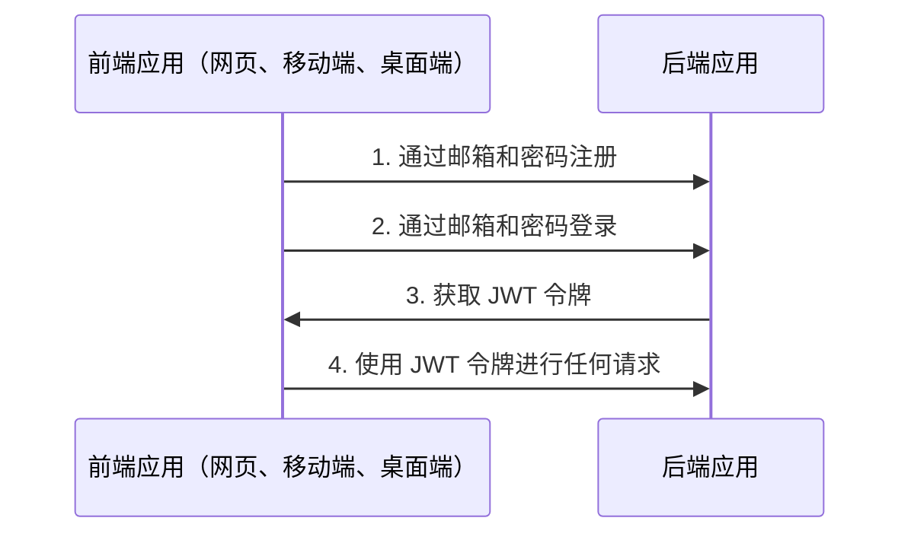
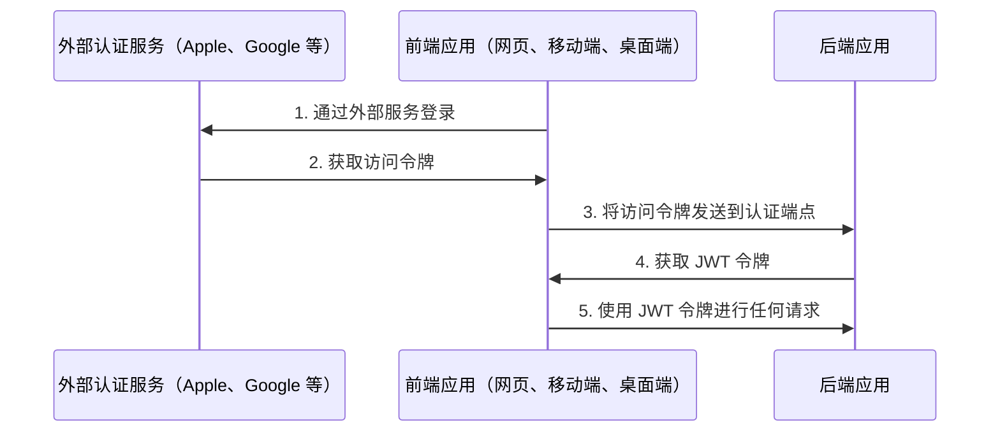

# 认证

## 目录 <!-- omit in toc -->

- [基本信息] (#general-info)
  - [通过邮箱认证流程] (#auth-via-email-flow)
  - [通过外部服务或社交网络认证流程] (#auth-via-external-services-or-social-networks-flow)
- [配置认证] (#configure-auth)
- [通过 Apple 认证] (#auth-via-apple)
- [通过 Facebook 认证] (#auth-via-facebook)
- [通过 Google 认证] (#auth-via-google)
- [关于 JWT 策略] (#about-jwt-strategy)
- [刷新令牌流程] (#refresh-token-flow)
  - [视频示例] (#video-example)
  - [支持多设备登录/会话] (#support-login-for-multiple-devices--sessions)
- [登出] (#logout)
- [问答] (#qa)
  - [在 `POST /api/v1/auth/logout` 或从数据库中删除会话后，用户仍然可以使用 `access token` 进行一段时间的请求。为什么？] (#after-post-apiv1authlogout-or-removing-session-from-the-database-the-user-can-still-make-requests-with-an-access-token-for-some-time-why)

---

## 基本信息

### 通过邮箱认证流程

默认情况下，样板使用邮箱和密码进行注册和登录。



<https://user-images.githubusercontent.com/6001723/224566194-1c1f4e98-5691-4703-b30e-92f99ec5d929.mp4>

### 通过外部服务或社交网络认证流程

您也可以通过其他外部服务或社交网络（如 Apple、Facebook 和 Google）进行注册。



对于通过外部服务或社交网络的认证，您需要：

1. 通过外部服务登录并获取访问令牌。
1. 使用第一步中在前端应用获取的访问令牌调用其中一个端点，并从后端应用获取 JWT 令牌。

   ```text
   POST /api/v1/auth/facebook/login

   POST /api/v1/auth/google/login

   POST /api/v1/auth/apple/login
   ```

1. 使用 JWT 令牌进行任何请求

---

## 配置认证

1. 为 `access token` 和 `refresh token` 生成密钥：

   ```bash
   node -e "console.log('\nAUTH_JWT_SECRET=' + require('crypto').randomBytes(256).toString('base64') + '\n\nAUTH_REFRESH_SECRET=' + require('crypto').randomBytes(256).toString('base64') + '\n\nAUTH_FORGOT_SECRET=' + require('crypto').randomBytes(256).toString('base64') + '\n\nAUTH_CONFIRM_EMAIL_SECRET=' + require('crypto').randomBytes(256).toString('base64'));"
   ```

1. 转到 `/.env` 并使用步骤 1 的输出替换 `AUTH_JWT_SECRET` 和 `AUTH_REFRESH_SECRET`。

   ```text
   AUTH_JWT_SECRET=第一步生成的密钥
   AUTH_REFRESH_SECRET=第一步生成的密钥
   ```

## 通过 Apple 认证

1. [在 Apple 上设置您的服务](https://www.npmjs.com/package/apple-signin-auth)
1. 在 `.env` 中更改 `APPLE_APP_AUDIENCE`

   ```text
   APPLE_APP_AUDIENCE=["com.company", "com.company.web"]
   ```

## 通过 Facebook 认证

1. 前往 <https://developers.facebook.com/apps/creation/> 并创建一个新应用

   

   

2. 前往 `Settings` -> `Basic` 并从您的应用获取 `App ID` 和 `App Secret`

   

3. 在 `.env` 中更改 `FACEBOOK_APP_ID` 和 `FACEBOOK_APP_SECRET`

   ```text
   FACEBOOK_APP_ID=123
   FACEBOOK_APP_SECRET=abc
   ```

## 通过 Google 认证

1. 您需要 `CLIENT_ID` 和 `CLIENT_SECRET`。通过前往[开发者控制台] (<https://console.cloud.google.com/)，点击您的项目（如果没有，请在> <https://console.cloud.google.com/projectcreate> 创建一个）-> `APIs & services` -> `credentials` 可以找到这些信息。
1. 在 `.env` 中更改 `GOOGLE_CLIENT_ID` 和 `GOOGLE_CLIENT_SECRET`

   ```text
   GOOGLE_CLIENT_ID=abc
   GOOGLE_CLIENT_SECRET=abc
   ```

## 关于 JWT 策略

在 `src/auth/strategies/jwt.strategy.ts` 文件的 `validate` 方法中，您可以看到我们不检查用户是否存在于数据库中，因为这是多余的，可能会失去 JWT 方法的好处，并可能影响应用程序性能。

要更好地理解 JWT 的工作原理，请观看视频解释 <https://www.youtube.com/watch?v=Y2H3DXDeS3Q> 并阅读这篇文章 <https://jwt.io/introduction/>

```typescript
// src/auth/strategies/jwt.strategy.ts

@Injectable()
export class JwtStrategy extends PassportStrategy(Strategy, 'jwt') {
  // ...

  public validate(payload) {
    if (!payload.id) {
      throw new UnauthorizedException();
    }

    return payload;
  }
}
```

> 如果您需要获取完整的用户信息，请在服务中获取。

## 刷新令牌流程

1. 在登录（`POST /api/v1/auth/email/login`）时，您将在响应中收到 `token`、`tokenExpires` 和 `refreshToken`。
1. 在每个常规请求中，您需要在 `Authorization` 头中发送 `token`。
1. 如果 `token` 已过期（通过客户端应用的 `tokenExpires` 属性检查），您需要将 `refreshToken` 在 `Authorization` 头中发送到 `POST /api/v1/auth/refresh` 以刷新 `token`。您将在响应中收到新的 `token`、`tokenExpires` 和 `refreshToken`。

### 视频示例

<https://github.com/brocoders/nestjs-boilerplate/assets/6001723/f6fdcc89-5ec6-472b-a6fc-d24178ad1bbb>

### 支持多设备登录/会话

样板支持通过刷新令牌流程进行多设备登录。这是通过 `sessions` 实现的。当用户登录时，会创建一个新会话并存储在数据库中。会话记录包含 `sessionId (id)`、`userId` 和 `hash`。

在每个 `POST /api/v1/auth/refresh` 请求中，我们检查数据库中的 `hash` 与刷新令牌中的 `hash` 是否相等。如果相等，我们返回新的 `token`、`tokenExpires` 和 `refreshToken`。然后我们更新数据库中的 `hash` 以禁止使用先前的刷新令牌。

## 登出

1. 调用以下端点：

   ```text
   POST /api/v1/auth/logout
   ```

2. 从您的客户端应用（cookies、localStorage 等）中删除 `access token` 和 `refresh token`。

## 问答

### 在 `POST /api/v1/auth/logout` 或从数据库中删除会话后，用户仍然可以使用 `access token` 进行一段时间的请求。为什么？

这是因为我们使用 `JWT`。`JWT` 是无状态的，所以我们不能撤销它们，但别担心，这是正确的行为，访问令牌将在 `AUTH_JWT_TOKEN_EXPIRES_IN` 中指定的时间后过期（默认值为 15 分钟）。如果您仍然需要立即撤销 `JWT` 令牌，您可以在每个请求中检查 [jwt.strategy.ts](https://github.com/brocoders/nestjs-boilerplate/blob/2896589f52d2df025f12069ba82ba4fac1db8ebd/src/auth/strategies/jwt.strategy.ts#L20-L26) 中是否存在会话。但不建议这样做，因为它可能会影响应用程序的性能。

---

上一篇：[使用数据库] (5. 数据库.md)

下一篇：[序列化] (7. 序列化.md)
