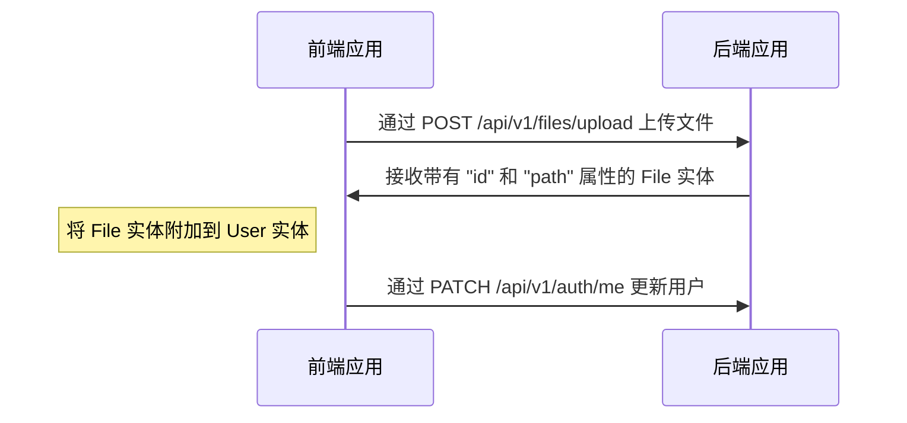
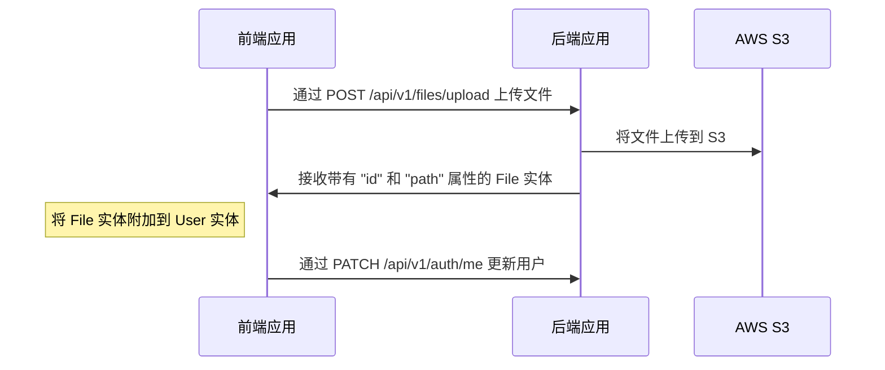
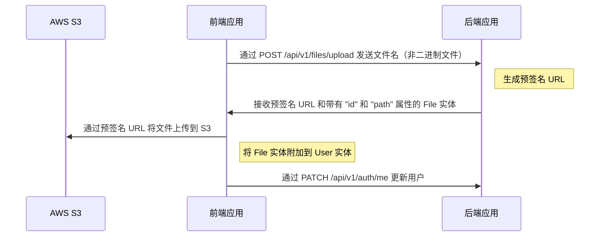

# 文件上传

---

## 目录 <!-- omit in toc -->

- [驱动支持] (#drivers-support)
- [`local` 驱动的上传和附加文件流程] (#uploading-and-attach-file-flow-for-local-driver)
  - [上传头像到用户档案的示例（local）] (#an-example-of-uploading-an-avatar-to-a-user-profile-local)
  - [视频示例] (#video-example)
- [`s3` 驱动的上传和附加文件流程] (#uploading-and-attach-file-flow-for-s3-driver)
  - [`s3` 驱动的配置] (#configuration-for-s3-driver)
  - [上传头像到用户档案的示例（S3）] (#an-example-of-uploading-an-avatar-to-a-user-profile-s3)
- [`s3-presigned` 驱动的上传和附加文件流程] (#uploading-and-attach-file-flow-for-s3-presigned-driver)
  - [`s3-presigned` 驱动的配置] (#configuration-for-s3-presigned-driver)
  - [上传头像到用户档案的示例（S3 预签名 URL）] (#an-example-of-uploading-an-avatar-to-a-user-profile-s3-presigned-url)
- [如何删除文件？] (#how-to-delete-files)

---

## 驱动支持

开箱即用的样板支持以下驱动：`local`、`s3` 和 `s3-presigned`。您可以在 `.env` 文件中设置它，变量为 `FILE_DRIVER`。如果您想使用其他服务来存储文件，可以进行扩展。

> 对于生产环境，我们建议使用 "s3-presigned" 驱动来减轻服务器负担。

---

## `local` 驱动的上传和附加文件流程

端点 `/api/v1/files/upload` 用于上传文件，它返回带有 `id` 和 `path` 的 `File` 实体。收到 `File` 实体后，您可以将其附加到另一个实体。

### 上传头像到用户档案的示例（local）



### 视频示例

<https://user-images.githubusercontent.com/6001723/224558636-d22480e4-f70a-4789-b6fc-6ea343685dc7.mp4>

## `s3` 驱动的上传和附加文件流程

端点 `/api/v1/files/upload` 用于上传文件，它返回带有 `id` 和 `path` 的 `File` 实体。收到 `File` 实体后，您可以将其附加到另一个实体。

### `s3` 驱动的配置

1. 打开 <https://s3.console.aws.amazon.com/s3/buckets>
1. 点击 "Create bucket"
1. 创建存储桶（例如，`your-unique-bucket-name`）
1. 打开您的存储桶
1. 点击 "Permissions" 标签
1. 找到 "Cross-origin resource sharing (CORS)" 部分
1. 点击 "Edit"
1. 粘贴以下配置

    ```json
    [
      {
        "AllowedHeaders": ["*"],
        "AllowedMethods": ["GET"],
        "AllowedOrigins": ["*"],
        "ExposeHeaders": []
      }
    ]
    ```

1. 点击 "Save changes"
1. 使用以下变量更新 `.env` 文件：

    ```dotenv
    FILE_DRIVER=s3
    ACCESS_KEY_ID=YOUR_ACCESS_KEY_ID
    SECRET_ACCESS_KEY=YOUR_SECRET_ACCESS_KEY
    AWS_S3_REGION=YOUR_AWS_S3_REGION
    AWS_DEFAULT_S3_BUCKET=YOUR_AWS_DEFAULT_S3_BUCKET
    ```

### 上传头像到用户档案的示例（S3）



## `s3-presigned` 驱动的上传和附加文件流程

端点 `/api/v1/files/upload` 用于上传文件。在这种情况下，`/api/v1/files/upload` 只接收 `fileName` 属性（不含二进制文件），并返回 `预签名 URL` 和带有 `id` 和 `path` 的 `File` 实体。收到 `预签名 URL` 和 `File` 实体后，您需要将文件上传到 `预签名 URL`，然后将 `File` 附加到另一个实体。

### `s3-presigned` 驱动的配置

1. 打开 <https://s3.console.aws.amazon.com/s3/buckets>
1. 点击 "Create bucket"
1. 创建存储桶（例如，`your-unique-bucket-name`）
1. 打开您的存储桶
1. 点击 "Permissions" 标签
1. 找到 "Cross-origin resource sharing (CORS)" 部分
1. 点击 "Edit"
1. 粘贴以下配置

    ```json
    [
      {
        "AllowedHeaders": ["*"],
        "AllowedMethods": ["GET", "PUT"],
        "AllowedOrigins": ["*"],
        "ExposeHeaders": []
      }
    ]
    ```

   对于生产环境，我们建议使用更严格的配置：

   ```json
   [
     {
       "AllowedHeaders": ["*"],
       "AllowedMethods": ["PUT"],
       "AllowedOrigins": ["https://your-domain.com"],
       "ExposeHeaders": []
     },
      {
        "AllowedHeaders": ["*"],
        "AllowedMethods": ["GET"],
        "AllowedOrigins": ["*"],
        "ExposeHeaders": []
      }
   ]
   ```

1. 点击 "Save changes"
1. 使用以下变量更新 `.env` 文件：

    ```dotenv
    FILE_DRIVER=s3-presigned
    ACCESS_KEY_ID=YOUR_ACCESS_KEY_ID
    SECRET_ACCESS_KEY=YOUR_SECRET_ACCESS_KEY
    AWS_S3_REGION=YOUR_AWS_S3_REGION
    AWS_DEFAULT_S3_BUCKET=YOUR_AWS_DEFAULT_S3_BUCKET
    ```

### 上传头像到用户档案的示例（S3 预签名 URL）



## 如何删除文件？

我们倾向于不删除文件，因为这可能在恢复数据时带来负面体验。出于这个原因，我们在数据库中也使用 [软删除](https://orkhan.gitbook.io/typeorm/docs/delete-query-builder#soft-delete) 方法。但是，如果您需要删除文件，可以创建自己的处理程序、定时任务等。

---

上一篇：[序列化] (serialization.md)

下一篇：[测试] (tests.md)
